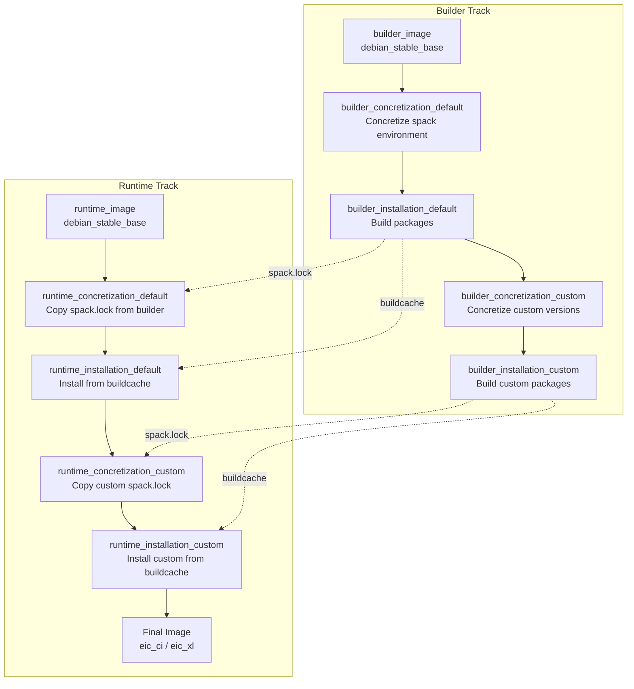
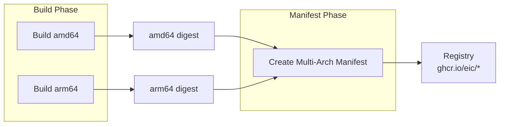
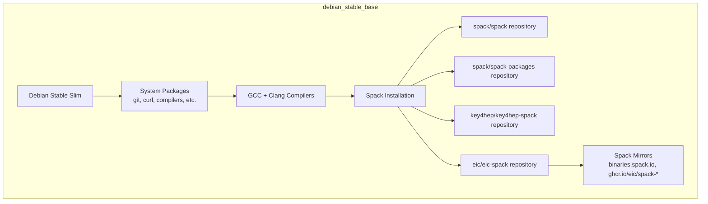
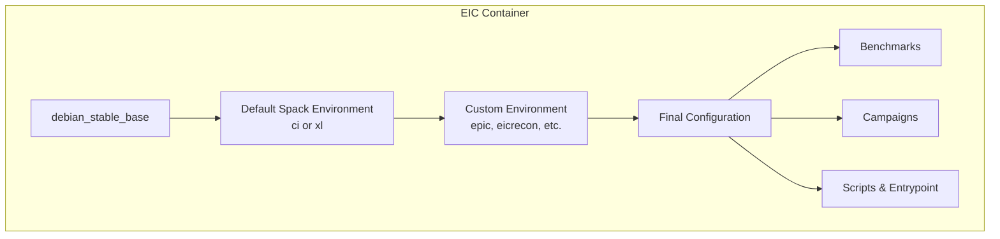
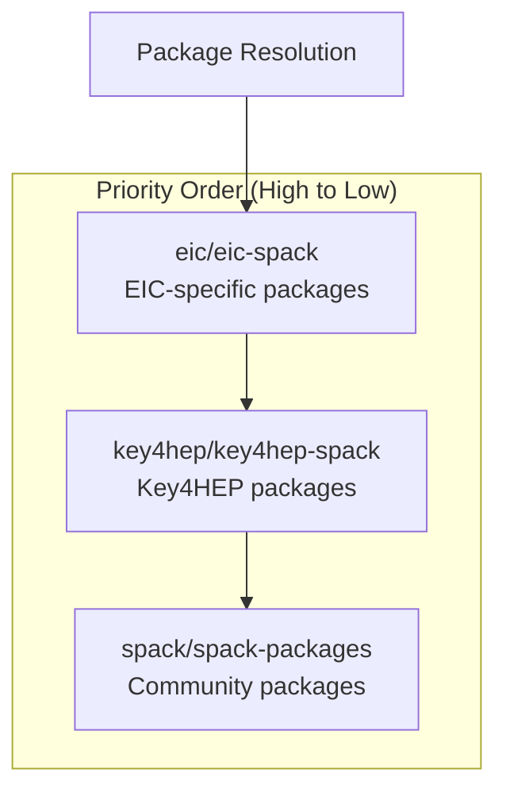

# Architecture Overview

The EIC container infrastructure uses a multi-stage build approach with separate builder and runtime tracks. This design ensures efficient builds while producing lightweight final images.

## Build Strategy

The container build follows a two-track approach:



## Multi-Architecture Support

The infrastructure supports both `amd64` and `arm64` architectures through parallel builds:



## Container Layer Structure

### Base Image (debian_stable_base)



### EIC Image (eic_ci / eic_xl)



## Spack Repository Hierarchy

The Spack package definitions come from multiple repositories with priority ordering:



## Caching Architecture

Multiple caching layers are used to optimize build times:

```mermaid
flowchart TB
    subgraph "Build Cache Types"
        RC[Registry Cache<br/>Docker layer cache in ghcr.io]
        GC[GitHub Actions Cache<br/>ccache, apt, spack source]
        BC[Spack Buildcache<br/>Pre-built binaries on ghcr.io]
    end
    
    subgraph "Cache Locations"
        RC --> R1[ghcr.io/eic/buildcache:*]
        GC --> G1[ccache]
        GC --> G2[/var/cache/apt]
        GC --> G3[/var/cache/spack]
        BC --> B1[ghcr.io/eic/spack-v2025.07.0]
    end
```

## Environment Variants

### CI Environment (eic_ci)

Minimal environment for continuous integration:
- Core HEP packages (ROOT, Geant4, DD4hep)
- Essential reconstruction tools
- No GUI dependencies (`-opengl`, `-webgui`)

### XL Environment (eic_xl)

Full development environment:
- All CI packages plus GUI support
- Development tools (emacs, gdb, valgrind, etc.)
- Additional Python packages
- Machine learning tools (TensorFlow, PyTorch, ONNX)
- Jupyter notebook support

## Version Configuration

Package versions are controlled through several configuration files:

| File | Purpose |
|------|---------|
| `spack.sh` | Spack core version and cherry-picks |
| `spack-packages.sh` | Spack-packages version and cherry-picks |
| `key4hep-spack.sh` | Key4HEP-spack version |
| `eic-spack.sh` | EIC-spack version |
| `spack-environment/packages.yaml` | Package version preferences and variants |
