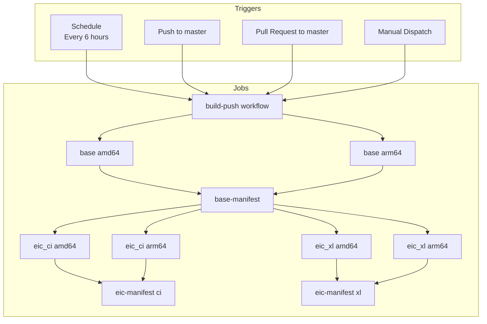
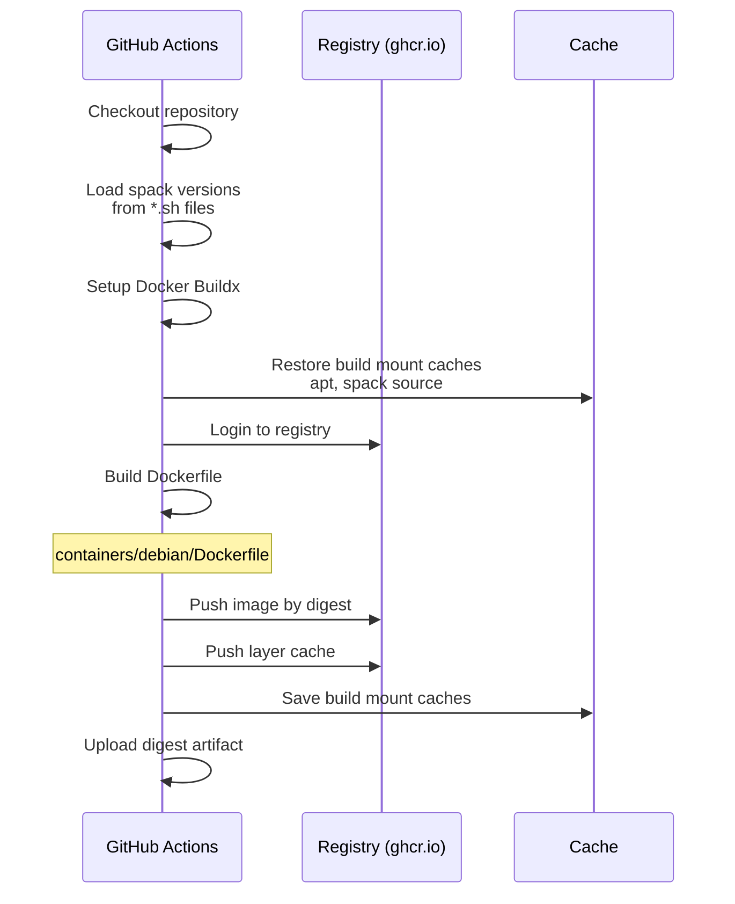
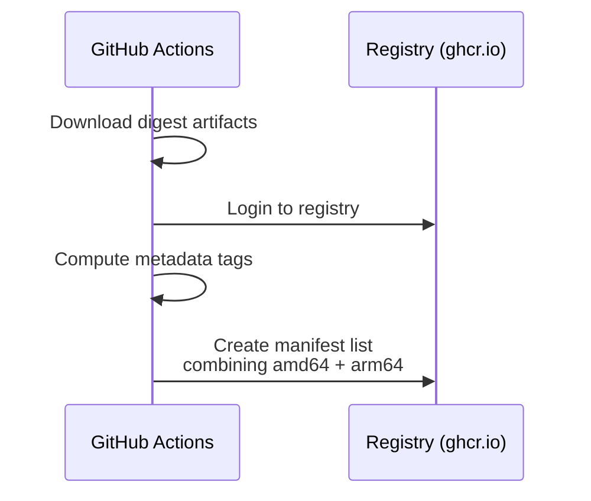
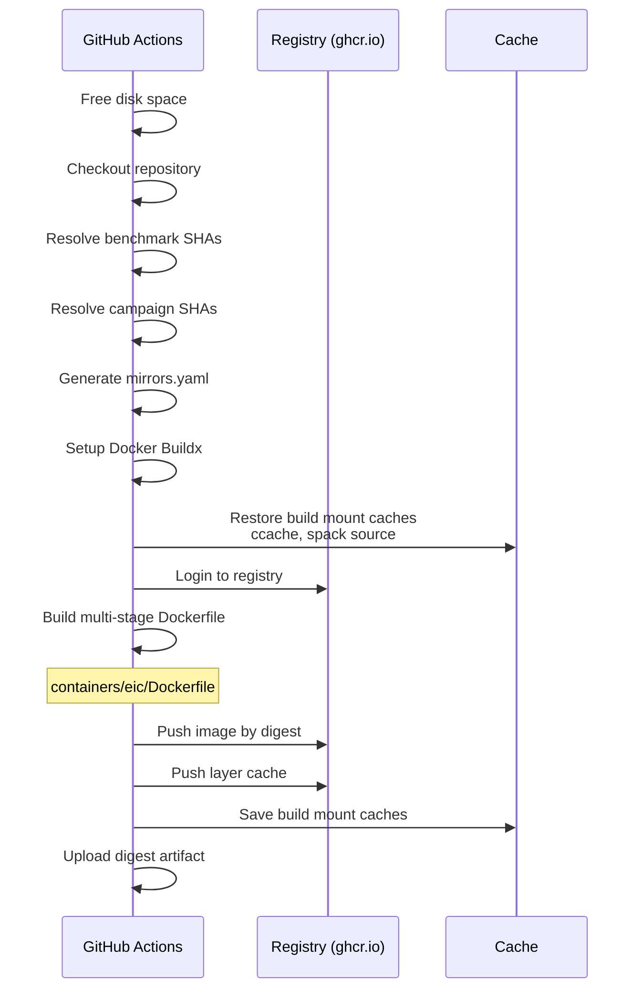

# Build Pipeline

The container build pipeline is implemented as a GitHub Actions workflow. This document describes the workflow structure and job dependencies.

## Workflow Overview



## Job Details

### Base Image Job

Builds the `debian_stable_base` image with Spack and compilers installed.



**Key Build Arguments:**
- `SPACK_ORGREPO`, `SPACK_VERSION`, `SPACK_SHA`, `SPACK_CHERRYPICKS`
- `SPACKPACKAGES_ORGREPO`, `SPACKPACKAGES_VERSION`, `SPACKPACKAGES_SHA`, `SPACKPACKAGES_CHERRYPICKS`
- `KEY4HEPSPACK_ORGREPO`, `KEY4HEPSPACK_VERSION`, `KEY4HEPSPACK_SHA`
- `EICSPACK_ORGREPO`, `EICSPACK_VERSION`, `EICSPACK_SHA`

### Base Manifest Job

Creates a multi-architecture manifest from the per-architecture digests.



**Output Tags:**
- `pipeline-{run_id}` - Internal tag for CI chaining
- `unstable-pr-{number}` - For pull requests
- Version tags for releases

### EIC Image Job

Builds the full EIC environment image on top of the base image.



**Key Build Arguments:**
- `ENV` - Environment type (`ci` or `xl`)
- `INTERNAL_TAG` - Base image tag to build from
- Benchmark SHAs for common_bench, detector_benchmarks, etc.
- Campaign SHAs for simulation_campaign_hepmc3, job_submission_*, etc.

**Secret Mounts:**
- `mirrors.yaml` - Spack buildcache configuration with credentials

### EIC Manifest Job

Creates multi-architecture manifests for each environment variant.

## Caching Strategy

### Docker Layer Cache

Stored in the registry using the `cache-to` and `cache-from` build options:

```yaml
cache-from: |
  type=registry,ref=ghcr.io/eic/buildcache:{image}-{branch}-{arch}
cache-to: type=registry,ref=ghcr.io/eic/buildcache:{image}-{branch}-{arch},mode=max
```

**Buildcache Cleanup**: When a pull request is closed or merged, the `cleanup-buildcache` workflow automatically removes all buildcache tags associated with that PR from both ghcr.io and eicweb.phy.anl.gov registries. This prevents buildcache accumulation and keeps the registries clean.

### Build Mount Cache

Uses [buildkit-cache-dance](https://github.com/reproducible-containers/buildkit-cache-dance) to persist mount caches:

| Cache | Path | Contents |
|-------|------|----------|
| `var-cache-apt` | `/var/cache/apt` | APT package cache |
| `var-lib-apt` | `/var/lib/apt` | APT lists cache |
| `var-cache-spack` | `/var/cache/spack` | Spack source tarballs |
| `ccache` | `/ccache` | Compiler cache |

### Spack Buildcache

Pre-built binaries are stored in OCI registries:

- **Read-only**: `oci://ghcr.io/eic/spack-{version}` - Public buildcache
- **Write**: Configured via secret `mirrors.yaml` mount during builds

## Workflow Triggers

### build-push workflow

| Trigger | Behavior |
|---------|----------|
| Schedule (cron) | Every 6 hours - nightly builds |
| Push to master | Build and push with `pipeline-*` tag |
| Pull Request | Build with `unstable-pr-*` tag |
| Manual Dispatch | Allows overriding EDM4EIC, EICRECON, JUGGLER versions |

### cleanup-buildcache workflow

| Trigger | Behavior |
|---------|----------|
| Pull Request closed | Automatically removes all buildcache tags associated with the branch slug (typically unique to the PR) from ghcr.io and eicweb.phy.anl.gov |
| Manual Dispatch | Allows manual cleanup of buildcache tags for a specific branch or PR by specifying a custom `ref_slug` parameter |

## Environment Matrix

The EIC job builds the following matrix:

| ENV | Architecture | Description |
|-----|--------------|-------------|
| ci | amd64 | CI environment for x86_64 |
| ci | arm64 | CI environment for ARM64 |
| xl | amd64 | Full environment for x86_64 |
| xl | arm64 | Full environment for ARM64 |

## Concurrency Control

```yaml
concurrency:
  group: ${{ github.workflow }}-${{ github.event.pull_request.number || github.ref }}
  cancel-in-progress: false
```

Workflows are grouped by PR number or branch, but **not cancelled** when new commits are pushed (builds are expensive and take hours).
