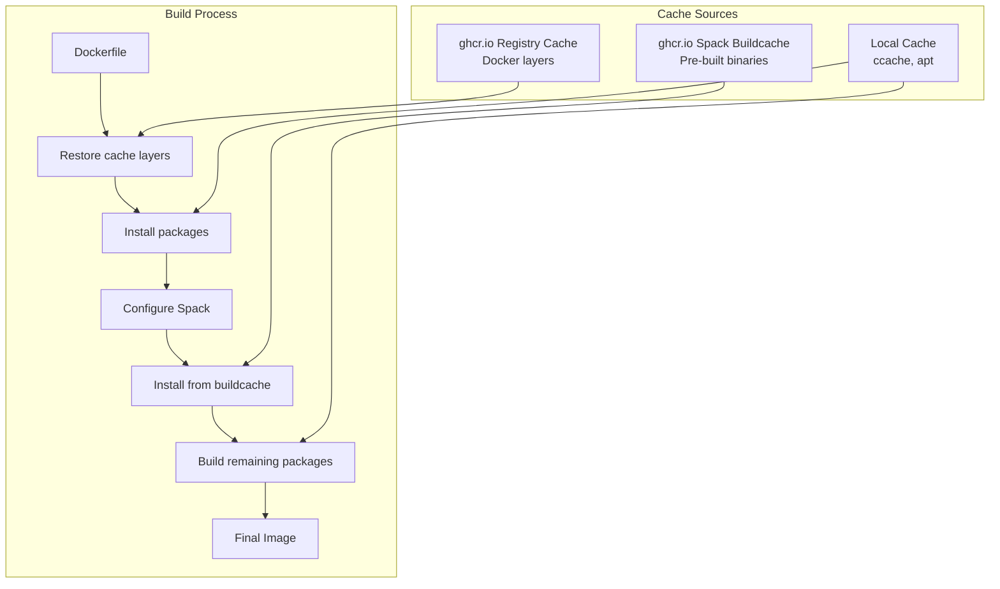

# Building Locally

This guide explains how to build the EIC containers locally, taking advantage of available caches to speed up builds.

## Prerequisites

- Docker with Buildx support (Docker 19.03+)
- At least 100GB of free disk space
- 8GB+ RAM recommended

```bash
# Verify Docker Buildx is available
docker buildx version
```

## Quick Start

### Building the Base Image

```bash
cd /path/to/containers

# Build the base image
docker buildx build \
  -f containers/debian/Dockerfile \
  -t debian_stable_base:local \
  containers/debian
```

### Building the EIC Image

```bash
# Build the full XL environment
docker buildx build \
  -f containers/eic/Dockerfile \
  --build-context spack-environment=spack-environment \
  --build-arg DOCKER_REGISTRY=ghcr.io/eic/ \
  --build-arg BUILDER_IMAGE=debian_stable_base \
  --build-arg RUNTIME_IMAGE=debian_stable_base \
  --build-arg INTERNAL_TAG=latest \
  --build-arg ENV=xl \
  -t eic_xl:local \
  containers/eic
```

## Taking Advantage of Caching

### 1. Registry Cache (Docker Layer Cache)

The public buildcache stored on ghcr.io can significantly speed up builds:

```bash
# Build with registry cache from ghcr.io
docker buildx build \
  -f containers/debian/Dockerfile \
  --cache-from type=registry,ref=ghcr.io/eic/buildcache:debian_stable_base-master-amd64 \
  -t debian_stable_base:local \
  containers/debian
```

For the EIC image:

```bash
docker buildx build \
  -f containers/eic/Dockerfile \
  --build-context spack-environment=spack-environment \
  --build-arg DOCKER_REGISTRY=ghcr.io/eic/ \
  --build-arg BUILDER_IMAGE=debian_stable_base \
  --build-arg RUNTIME_IMAGE=debian_stable_base \
  --build-arg INTERNAL_TAG=latest \
  --build-arg ENV=xl \
  --cache-from type=registry,ref=ghcr.io/eic/buildcache:eic_xl-default-master-amd64 \
  -t eic_xl:local \
  containers/eic
```

### 2. Spack Buildcache (Pre-built Binaries)

The most significant speedup comes from using pre-built Spack binaries. The containers are configured to automatically fetch from the public buildcache:

```
ghcr.io/eic/spack-v2025.07.0  # OCI-based Spack buildcache
binaries.spack.io/v1.0        # Official Spack buildcache
```

No additional configuration is needed - the base image is pre-configured to use these mirrors.

### 3. Local Build Caches

For repeated local builds, set up persistent caches:

```bash
# Create cache directories
mkdir -p ~/.cache/eic-containers/{apt,spack,ccache}

# Build with local cache mounts
docker buildx build \
  -f containers/debian/Dockerfile \
  --build-arg jobs=8 \
  -t debian_stable_base:local \
  containers/debian
```

## Build Architecture Diagram



## Full Build Script

Here's a complete script for building locally with all optimizations:

```bash
#!/bin/bash
set -e

REPO_DIR="$(pwd)"
REGISTRY="ghcr.io/eic"
ARCH=$(uname -m | sed 's/x86_64/amd64/' | sed 's/aarch64/arm64/')

# Load version information
source spack.sh
source spack-packages.sh
source key4hep-spack.sh
source eic-spack.sh

# Helper to resolve git refs
resolve_ref() {
  .ci/resolve_git_ref "$1" "$2"
}

# Build base image
echo "=== Building debian_stable_base ==="
docker buildx build \
  -f containers/debian/Dockerfile \
  --build-arg SPACK_ORGREPO=${SPACK_ORGREPO} \
  --build-arg SPACK_VERSION=${SPACK_VERSION} \
  --build-arg SPACKPACKAGES_ORGREPO=${SPACKPACKAGES_ORGREPO} \
  --build-arg SPACKPACKAGES_VERSION=${SPACKPACKAGES_VERSION} \
  --build-arg KEY4HEPSPACK_ORGREPO=${KEY4HEPSPACK_ORGREPO} \
  --build-arg KEY4HEPSPACK_VERSION=${KEY4HEPSPACK_VERSION} \
  --build-arg EICSPACK_ORGREPO=${EICSPACK_ORGREPO} \
  --build-arg EICSPACK_VERSION=${EICSPACK_VERSION} \
  --build-arg jobs=8 \
  --cache-from type=registry,ref=${REGISTRY}/buildcache:debian_stable_base-master-${ARCH} \
  -t debian_stable_base:local \
  --load \
  containers/debian

# Build EIC image
echo "=== Building eic_xl ==="
docker buildx build \
  -f containers/eic/Dockerfile \
  --build-context spack-environment=spack-environment \
  --build-arg DOCKER_REGISTRY="" \
  --build-arg BUILDER_IMAGE=debian_stable_base:local \
  --build-arg RUNTIME_IMAGE=debian_stable_base:local \
  --build-arg INTERNAL_TAG="" \
  --build-arg ENV=xl \
  --cache-from type=registry,ref=${REGISTRY}/buildcache:eic_xl-default-master-${ARCH} \
  -t eic_xl:local \
  --load \
  containers/eic

echo "=== Build complete ==="
echo "Run with: docker run -it eic_xl:local"
```

## Build Arguments Reference

### Base Image (containers/debian/Dockerfile)

| Argument | Description | Default |
|----------|-------------|---------|
| `BASE_IMAGE` | Base Debian image | `debian:stable-slim` |
| `SPACK_ORGREPO` | Spack GitHub org/repo | `spack/spack` |
| `SPACK_VERSION` | Spack version/branch | `develop` |
| `SPACK_SHA` | Specific commit SHA | (resolved from version) |
| `SPACK_CHERRYPICKS` | Space-separated cherry-pick SHAs | |
| `SPACKPACKAGES_*` | Similar args for spack-packages | |
| `KEY4HEPSPACK_*` | Similar args for key4hep-spack | |
| `EICSPACK_*` | Similar args for eic-spack | |
| `jobs` | Parallel build jobs | `1` |

### EIC Image (containers/eic/Dockerfile)

| Argument | Description | Default |
|----------|-------------|---------|
| `DOCKER_REGISTRY` | Registry prefix for base images | `eicweb/` |
| `BUILDER_IMAGE` | Builder base image name | `debian_stable_base` |
| `RUNTIME_IMAGE` | Runtime base image name | `debian_stable_base` |
| `INTERNAL_TAG` | Tag for base images | `master` |
| `ENV` | Environment type (`ci` or `xl`) | `xl` |
| `EDM4EIC_SHA` | Custom edm4eic commit | |
| `EICRECON_SHA` | Custom eicrecon commit | |
| `EPIC_SHA` | Custom epic commit | |
| `JUGGLER_SHA` | Custom juggler commit | |

## Troubleshooting

### Build Fails with Out of Memory

Reduce the number of parallel jobs:

```bash
docker buildx build --build-arg jobs=2 ...
```

### Build Takes Too Long

1. Ensure you're using registry cache (`--cache-from`)
2. Check that Spack buildcache is accessible
3. Build the CI environment first (smaller): `--build-arg ENV=ci`

### Cannot Pull from ghcr.io

The buildcache is public, but if you encounter authentication issues:

```bash
# Anonymous pull should work
docker pull ghcr.io/eic/debian_stable_base:latest

# Or login (for push access)
echo $GITHUB_TOKEN | docker login ghcr.io -u $GITHUB_USER --password-stdin
```

### Spack Installation Timeouts

The containers increase the default timeout. For local builds, ensure stable network connectivity.

## Building for ARM64 on x86_64

Using QEMU emulation (slower but works):

```bash
# Setup QEMU
docker run --privileged --rm tonistiigi/binfmt --install arm64

# Build for ARM64
docker buildx build \
  --platform linux/arm64 \
  -f containers/debian/Dockerfile \
  -t debian_stable_base:local-arm64 \
  containers/debian
```

## Next Steps

- See [Architecture Overview](architecture.md) for understanding the build structure
- See [Build Pipeline](build-pipeline.md) for CI/CD details
- See [Spack Environment](spack-environment.md) for package configuration
