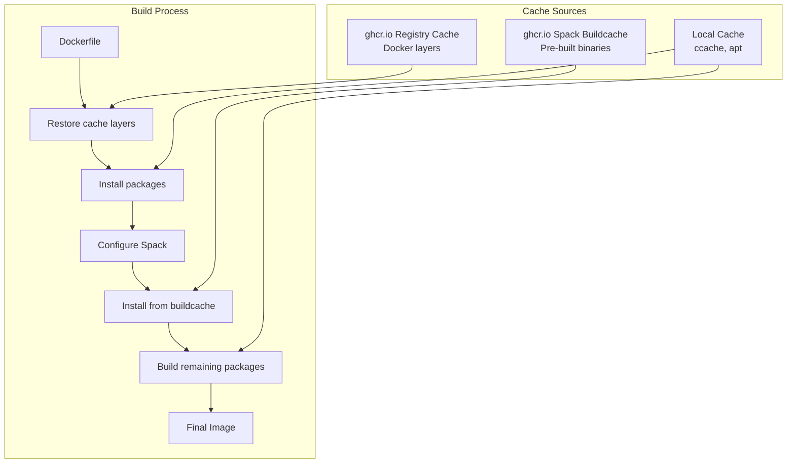

# Building Locally

This guide explains how to build the EIC containers locally, taking advantage of available caches to speed up builds.

## Prerequisites

- Docker with Buildx support (Docker 19.03+)
- At least 100GB of free disk space
- 8GB+ RAM recommended

```bash
# Verify Docker Buildx is available
docker buildx version
```

## Quick Start

The repository provides two build scripts — `build-base.sh` and `build-eic.sh` — that
encapsulate the full build logic. These are the same scripts used by the CI pipelines, so
local builds are guaranteed to be equivalent.

### Building the Base Image

```bash
cd /path/to/containers

# Build debian_stable_base with 8 parallel jobs
bash build-base.sh --jobs 8
```

This produces a local image tagged `debian_stable_base:local`.

### Building the EIC Image

```bash
# Build the full XL environment (uses debian_stable_base:local as base)
bash build-eic.sh --env xl --jobs 8
```

This produces a local image tagged `eic_xl:local`.

### Other environments

```bash
# Minimal CI environment (faster to build)
bash build-eic.sh --env ci

# Debug build
bash build-eic.sh --env dbg

# CUDA environment (requires cuda_devel base image)
bash build-base.sh --image cuda_devel
bash build-eic.sh --env cuda --builder-image cuda_devel --runtime-image cuda_runtime
```

## Taking Advantage of Caching

### 1. Registry Cache (Docker Layer Cache)

The public buildcache stored on ghcr.io can significantly speed up builds:

```bash
# Build with registry cache from ghcr.io
docker buildx build \
  -f containers/debian/Dockerfile \
  --cache-from type=registry,ref=ghcr.io/eic/buildcache:debian_stable_base-master-amd64 \
  -t debian_stable_base:local \
  containers/debian
```

For the EIC image:

```bash
docker buildx build \
  -f containers/eic/Dockerfile \
  --build-context spack-environment=spack-environment \
  --build-arg DOCKER_REGISTRY=ghcr.io/eic/ \
  --build-arg BUILDER_IMAGE=debian_stable_base \
  --build-arg RUNTIME_IMAGE=debian_stable_base \
  --build-arg INTERNAL_TAG=latest \
  --build-arg ENV=xl \
  --cache-from type=registry,ref=ghcr.io/eic/buildcache:eic_xl-default-master-amd64 \
  -t eic_xl:local \
  containers/eic
```

### 2. Spack Buildcache (Pre-built Binaries)

The most significant speedup comes from using pre-built Spack binaries. The containers are configured to automatically fetch from the public buildcache:

```
ghcr.io/eic/spack-v2025.07.0  # OCI-based Spack buildcache
binaries.spack.io/v1.0        # Official Spack buildcache
```

No additional configuration is needed - the base image is pre-configured to use these mirrors.

### 3. Local Build Caches

The build scripts automatically pull Docker-layer caches from `ghcr.io/eic/buildcache`.
Spack binary caches are fetched directly by Spack during the build from `ghcr.io/eic/spack-*`
and `binaries.spack.io`. No extra configuration is needed.

## Build Architecture Diagram


```mermaid
flowchart TB
    subgraph "Cache Sources"
        RC[ghcr.io Registry Cache<br/>Docker layers]
        BC[ghcr.io Spack Buildcache<br/>Pre-built binaries]
        LC[Local Cache<br/>ccache, apt]
    end

    subgraph "Build Process"
        D[Dockerfile]
        D --> L1[Restore cache layers]
        L1 --> L2[Install packages]
        L2 --> L3[Configure Spack]
        L3 --> L4[Install from buildcache]
        L4 --> L5[Build remaining packages]
        L5 --> I[Final Image]
    end

    RC --> L1
    BC --> L4
    LC --> L2
    LC --> L5
```

## Build Script Reference

Both scripts live in the repository root and accept command-line flags. All flags can also
be set via environment variables of the same name (e.g. `JOBS=8 bash build-base.sh`).

### `build-base.sh`

Builds the base image that all EIC images depend on.

```
bash build-base.sh [options]

  --image IMAGE       Image to build: debian_stable_base (default), cuda_devel, cuda_runtime
  --base-image IMAGE  Upstream image (derived automatically from --image if omitted)
  --platform PLATFORM linux/amd64 (default), linux/arm64
  --jobs N            Parallel Spack build jobs (default: nproc)
  --tag TAG           Output image tag (default: local)
```

### `build-eic.sh`

Builds an EIC software environment image.

```
bash build-eic.sh [options]

  --env ENV           Environment: ci, xl (default), cuda, dbg, jl, prod, cvmfs, tf, ...
  --build-type TYPE   default (default) or nightly
  --builder-image IMG Builder base image name (default: debian_stable_base)
  --runtime-image IMG Runtime base image name (default: debian_stable_base)
  --platform PLATFORM linux/amd64 (default), linux/arm64
  --jobs N            Parallel Spack build jobs (default: 4)
  --base-tag TAG      Tag of the base image to pull (default: local)
  --tag TAG           Output image tag (default: local)
```

## Build Arguments Reference

### Base Image (containers/debian/Dockerfile)

| Argument | Description | Default |
|----------|-------------|---------|
| `BASE_IMAGE` | Base Debian image | `debian:trixie-slim` |
| `SPACK_ORGREPO` | Spack GitHub org/repo | `spack/spack` |
| `SPACK_VERSION` | Spack version/branch | (from `spack.sh`) |
| `SPACK_SHA` | Specific commit SHA | (resolved from version) |
| `SPACK_CHERRYPICKS` | Newline-separated cherry-pick SHAs | (from `spack.sh`) |
| `SPACKPACKAGES_*` | Similar args for spack-packages | (from `spack-packages.sh`) |
| `KEY4HEPSPACK_*` | Similar args for key4hep-spack | (from `key4hep-spack.sh`) |
| `EICSPACK_*` | Similar args for eic-spack | (from `eic-spack.sh`) |
| `jobs` | Parallel build jobs | `1` |

### EIC Image (containers/eic/Dockerfile)

| Argument | Description | Default |
|----------|-------------|---------|
| `DOCKER_REGISTRY` | Registry prefix for base images | `ghcr.io/eic/` |
| `BUILDER_IMAGE` | Builder base image name | `debian_stable_base` |
| `RUNTIME_IMAGE` | Runtime base image name | `debian_stable_base` |
| `INTERNAL_TAG` | Tag for base images | `local` |
| `ENV` | Environment type | `xl` |
| `SPACK_DUPLICATE_ALLOWLIST` | Pipe-separated allowed duplicates | (per ENV) |
| `EDM4EIC_SHA` | Custom edm4eic commit | |
| `EICRECON_SHA` | Custom eicrecon commit | |
| `EPIC_SHA` | Custom epic commit | |
| `JUGGLER_SHA` | Custom juggler commit | |

## Troubleshooting

### Build Fails with Out of Memory

Reduce the number of parallel jobs:

```bash
bash build-base.sh --jobs 2
```

### Build Takes Too Long

1. Ensure you're on a fast network (registry cache is fetched from `ghcr.io`)
2. Build the CI environment first (smaller): `bash build-eic.sh --env ci`

### Cannot Pull from ghcr.io

The buildcache is public, but if you encounter authentication issues:

```bash
# Anonymous pull should work
docker pull ghcr.io/eic/debian_stable_base:latest

# Or login (for push access)
echo $GITHUB_TOKEN | docker login ghcr.io -u $GITHUB_USER --password-stdin
```

### Spack Installation Timeouts

The containers increase the default timeout. For local builds, ensure stable network connectivity.

## Building for ARM64 on x86_64

Using QEMU emulation (slower but works):

```bash
# Setup QEMU
docker run --privileged --rm tonistiigi/binfmt --install arm64

# Build for ARM64
bash build-base.sh --platform linux/arm64 --tag local-arm64
```

## Next Steps

- See [Architecture Overview](architecture.md) for understanding the build structure
- See [Build Pipeline](build-pipeline.md) for CI/CD details
- See [Spack Environment](spack-environment.md) for package configuration
