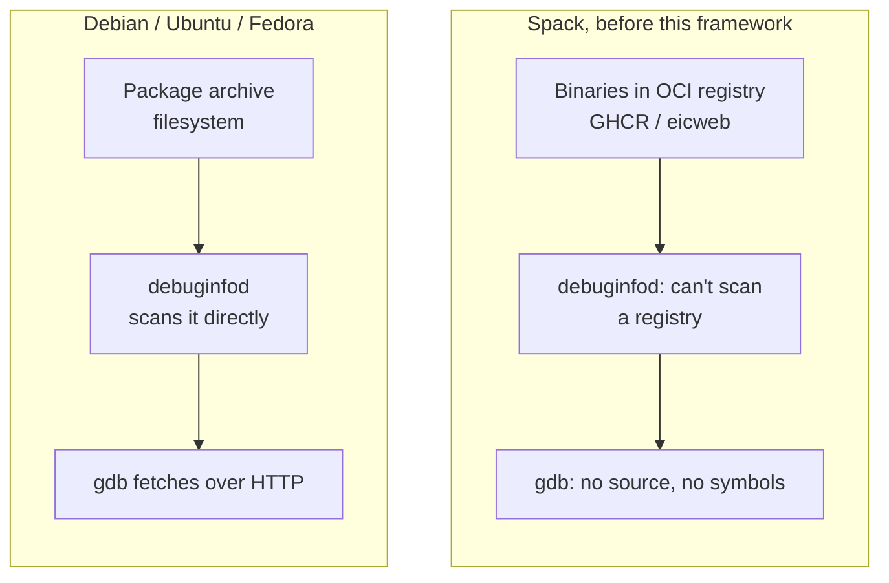
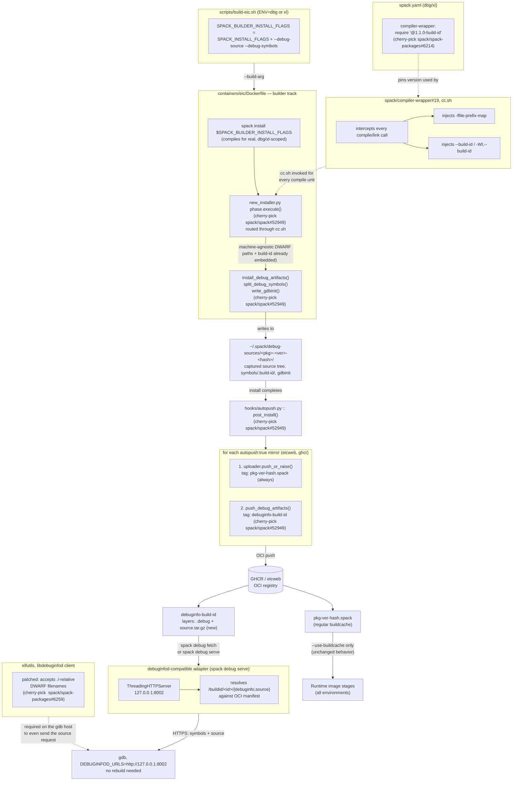

# Debuggable Installations & OCI-backed debuginfod

This document explains the debuggable-installations framework used by the `dbg` and `xl` Spack environments:

* **Capture**: Spack captures DWARF-referenced sources and symbols during installation.
* **Store**: The artifacts are pushed to existing OCI registries (EIC's GHCR/eicweb).
* **Retrieve**: `gdb`/`debuginfod` fetches them on demand, without requiring the original build directory.

## Why this exists

Debug info embeds the machine-specific, build-time source path in the binary's DWARF data. Spack removes its temporary build directory after installation, leaving that path invalid and making the binary difficult to debug later, while making the debug info non-redistributable due to machine-specific metadata.

Linux distributions address this with `debuginfod`, which serves debug symbols and source from filesystem-based package archives. Spack's buildcache is stored in OCI registries (GHCR/eicweb), which debuginfod cannot access directly.



This framework closes that gap:

* Makes DWARF paths machine-agnostic.
* Captures source and symbol data at install time and after the fact.
* Stores it in the same OCI registries used by the build cache, tagged by build ID.
* Resolves GDB build-ID lookups against OCI data over HTTPS via a lightweight debuginfod-compatible adapter.

## Cherry-picks

Enabled via `spack.sh` and `spack-packages.sh`:

```bash
# spack.sh
## 2ba3505dd8985a0fc86695e43cae0020fc50daa8: feat: debuggable installations (source hook, symbol
##   splitting, gdbinit, OCI autopush) plus debuginfod, squashed and cherry-picked via open draft
##   PR spack/spack#52949

# spack-packages.sh
## fdd30418cfd404a8de135c5fcfc349d5de87f84b: compiler-wrapper: add 1.1.0-build-id prototype version (spack-packages#6214)
## 5945d81a8359eed559ec60b1be9151de57473f51: elfutils: patch debuginfod_find_source to accept ./-relative filenames (spack-packages#6259)
```

## Environment wiring

`compiler-wrapper@1.1.0-build-id` and `RelWithDebInfo` overrides for ROOT/Geant4 and dependents in `xl/spack.yaml` and `xl/epic/spack.yaml`, with `elfutils@0.194+debuginfod` GDB support:

```yaml
packages:
  compiler-wrapper:
    require:
    - '@1.1.0-build-id'
  root:
    require:
    - build_type=RelWithDebInfo
  geant4:
    require:
    - build_type=RelWithDebInfo
  acts:
    require:
    - build_type=RelWithDebInfo
  # ...similarly for celeritas, dd4hep, edm4hep, hepmc3, podio, sherpa
  professor:
    require:
    - cflags=-g
    - cxxflags=-g
  pythia8:
    require:
    - cflags=-g
    - cxxflags=-g
specs:
- gdb ^elfutils@0.194+debuginfod
- ...
```

## Full pipeline



## Why this is safe for shared infrastructure

* **Opt-in only.** `--debug-source` and `--debug-symbols` are enabled only for `dbg`/`xl`; `push_debug_artifacts` runs only when `debug_source_dir(spec)` exists. `ci`, `prod`, and other environments are unaffected.
* **Reuses existing infrastructure.** Uses the existing OCI registries (`eicweb`, `ghcr`), `autopush` hook, and credentials from `mirrors.yaml.in`. No new services, registries, or access models.
* **Build-ID-based keying.** Debug artifacts are keyed by build ID, so the same binary always resolves to the same debug data, regardless of concretization.


## Current scope and open questions

* `spack debug serve` is local/on-demand (`--start-daemon`, `--stop-daemon`, `--status`), not a persistent service.
* A shared persistent debuginfod service vs. local `spack debug serve` instances using shared OCI registries remains an open infrastructure decision.

## Related Documentation

- [Architecture Overview](architecture.md) - Build system structure
- [Spack Environment](spack-environment.md) - Spack configuration and packages
- [Build Pipeline](build-pipeline.md) - CI workflow details