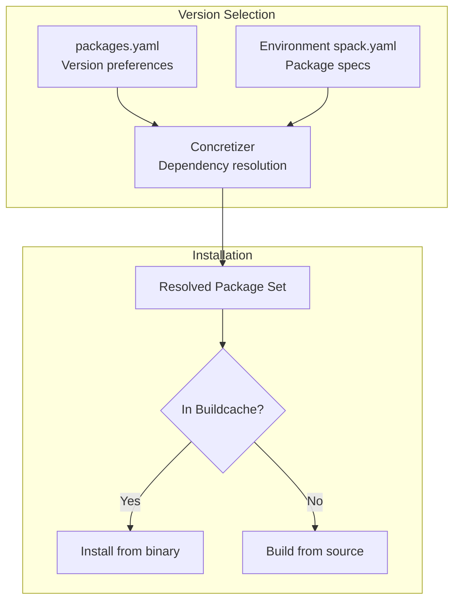

# Spack Environment

The EIC containers use [Spack](https://spack.io/) for package management. This document explains the Spack configuration and how packages are selected and built.

## Spack Repository Stack

The container uses multiple Spack repositories with the following priority (highest first):

```mermaid
flowchart TB
    subgraph "Repository Priority"
        direction TB
        E[eic/eic-spack<br/>EIC-specific packages]
        K[key4hep/key4hep-spack<br/>High-energy physics packages]
        SP[spack/spack-packages<br/>Extended community packages]
        S[spack/spack<br/>Core Spack packages]
    end
    
    E --> K --> SP --> S
    
    subgraph "Locations in Container"
        E -.- EL[/opt/spack-packages/repos/eic-spack]
        K -.- KL[/opt/spack-packages/repos/key4hep-spack]
        SP -.- SPL[/opt/spack-packages/repos/spack_repo/builtin]
        S -.- SL[/opt/spack/var/spack/repos/builtin]
    end
```

## Environment Configurations

### Environment Files

```
spack-environment/
├── packages.yaml      # Global package preferences
├── concretizer.yaml   # Concretization settings
├── view.yaml          # Spack view configuration
├── ci/                # CI environment
│   ├── spack.yaml     # CI package specs
│   └── epic/
│       └── spack.yaml # CI epic-specific specs
└── xl/                # Full (XL) environment
    ├── spack.yaml     # XL package specs
    └── epic/
        └── spack.yaml # XL epic-specific specs
```

### packages.yaml Structure

The `packages.yaml` file defines version preferences and build variants:

```yaml
packages:
  all:
    require:
    - '%gcc'                         # Use GCC compiler
    - any_of: [+ipo, '@:']           # Enable IPO if supported
    - any_of: [build_system=cmake, '@:']
    - any_of: [build_type=Release, '@:']
  
  # Package-specific requirements
  root:
    require:
    - '@6.36.04'
    - cxxstd=20 +fftw +fortran +gdml +http +python +root7 +tmva
    - any_of: [+opengl +webgui, -opengl -webgui]
```

### Environment Variants

#### CI Environment (`spack-environment/ci/`)

Minimal environment for continuous integration testing:

```yaml
specs:
- acts
- dd4hep -ddeve           # Without event display
- geant4 -opengl          # Without OpenGL
- root -opengl -webgui    # Without GUI components
- ...
```

**Characteristics:**
- Headless operation (no GUI dependencies)
- Faster build times
- Smaller image size
- Essential reconstruction tools only

#### XL Environment (`spack-environment/xl/`)

Full development environment with all features:

```yaml
specs:
- acts
- dd4hep +ddeve           # With event display
- geant4 +opengl          # With OpenGL support
- root +opengl +webgui    # Full GUI support
- claude-code             # AI coding assistant
- github-copilot          # AI coding assistant
- emacs                   # Editor
- jupyter                 # Notebooks
- py-tensorflow           # Machine learning
- py-torch                # Machine learning
- ...
```

**Additional packages in XL:**
- Development tools (emacs, gdb, valgrind, lcov)
- GUI support (Qt, OpenGL, X11)
- Machine learning (TensorFlow, PyTorch, ONNX)
- Jupyter notebook ecosystem
- Additional Monte Carlo generators

### EPIC Subenvironment

Both CI and XL have an `epic/` subdirectory with the EPIC detector packages:

```yaml
spack:
  include_concrete:
  - /opt/spack-environment/xl  # or ci
  specs:
  - algorithms
  - edm4eic
  - eicrecon
  - epic@main              # Current development
  - epic@25.08.0           # Tagged versions
  - epic@25.09.0
  - epic@25.10.0
  - juggler
```

## Version Control

### Version Configuration Files

| File | Contents |
|------|----------|
| `spack.sh` | Spack core version |
| `spack-packages.sh` | Spack-packages version |
| `key4hep-spack.sh` | Key4HEP-spack version |
| `eic-spack.sh` | EIC-spack version |

### Cherry-picks

Spack versions can include cherry-picks from newer commits:

```bash
# From spack.sh
SPACK_VERSION="v1.0.2"
SPACK_CHERRYPICKS=$(cat <<- EOF
09f75ee426a2e05e0543570821582480ff823ba5
a462612b64e97fa7dfe461c32c58553fd6ec63c5
EOF
)
```

## Package Selection Flow



## Concretizer Configuration

From `concretizer.yaml`:

```yaml
concretizer:
  targets:
    host_compatible: false
  unify: true
  reuse: false
```

- **`host_compatible: false`**: Build for target architecture, not host
- **`unify: true`**: Single version of each package in environment
- **`reuse: false`**: Don't reuse packages from buildcache during concretization

## Key Packages

### Core Physics Packages

| Package | Description |
|---------|-------------|
| `root` | Data analysis framework |
| `geant4` | Particle simulation |
| `dd4hep` | Detector description toolkit |
| `acts` | Track reconstruction |
| `hepmc3` | Event record format |
| `podio` | Event data model framework |
| `edm4hep` | Common HEP event data model |

### EIC-Specific Packages

| Package | Description |
|---------|-------------|
| `edm4eic` | EIC event data model |
| `eicrecon` | EIC reconstruction framework |
| `epic` | EPIC detector geometry |
| `npsim` | Nuclear physics simulation |
| `juggler` | Gaudi algorithms for EIC |
| `irt` | Imaging RICH Toolkit |

### Development Tools

| Package | Description |
|---------|-------------|
| `cmake` | Build system |
| `ninja` | Fast build tool |
| `gdb` | Debugger |
| `valgrind` | Memory analyzer |
| `lcov` | Code coverage |
| `iwyu` | Include-what-you-use |

## Modifying Packages

### Updating a Package Version

1. Edit `spack-environment/packages.yaml`:
   ```yaml
   packages:
     mypackage:
       require:
       - '@1.2.3'  # Update version
   ```

2. If package definition needs updating (from newer Spack):
   - Add cherry-pick to `spack-packages.sh`

### Adding a New Package

1. Check if package exists in Spack repositories
2. Add to appropriate `spack.yaml`:
   ```yaml
   specs:
   - new-package
   ```
3. Add version/variant requirements to `packages.yaml` if needed

### Creating Custom Package Versions

Using custom commit SHA:

```bash
# Via workflow dispatch inputs
EICSPACK_VERSION=abc123def...  # Override eic-spack repository version
EDM4EIC_VERSION=abc123def...   # Override edm4eic package version
EICRECON_VERSION=abc123def...  # Override eicrecon package version
JUGGLER_VERSION=abc123def...   # Override juggler package version

# In Dockerfile, these become:
# - eic-spack repository checked out at specified commit
# - edm4eic@git.abc123def=main
# - eicrecon@git.abc123def=main
# - juggler@git.abc123def=main
```

## Inspecting the Environment

Inside a container:

```bash
# List installed packages
spack find

# Show package info
spack info root

# Show package dependencies
spack spec root

# Show environment graph
spack graph --dot

# Show loaded environment
spack env status
```

## Related Documentation

- [Architecture Overview](architecture.md) - Build system structure
- [Building Locally](building-locally.md) - Local build instructions
- [Build Pipeline](build-pipeline.md) - CI workflow details
